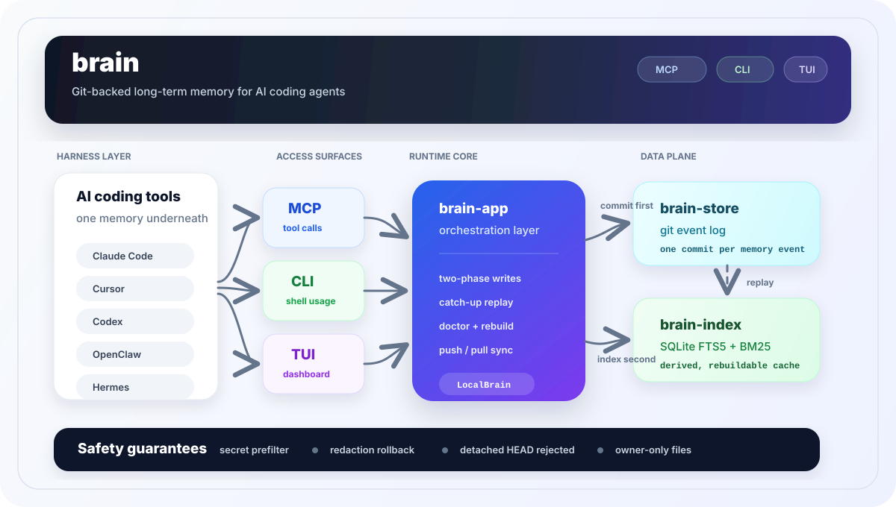

# brain

<p align="center">
  <strong>Git-backed long-term memory for AI coding agents.</strong>
</p>

<p align="center">
  
  
  
</p>

`brain` gives Claude Code, Cursor, Codex, OpenClaw, Hermes, and MCP-capable
tools one shared local memory. Notes are stored as git commits in `~/.brain`,
indexed for search, and available through the CLI, TUI, and MCP server.

<p align="center">
  <a href="https://x.com/Av1dlive">Follow @Av1dlive on X</a>
</p>

<p align="center">
  
</p>

## Install

Homebrew on macOS installs the prebuilt binary:

```bash
brew install codejunkie99/tap/brain
brain onboard
```

From source:

```bash
git clone https://github.com/codejunkie99/brain.git
cd brain
cargo install --path crates/brain-cli
brain onboard
```

## First run

```bash
brain onboard
```

Onboarding creates or keeps `~/.brain`, lets you choose which agents to wire,
shows the exact files it will write, then asks before saving. It does not
create cloud accounts, install daemons, store API keys, or send memory anywhere.

You can type agent names naturally:

```text
claude code
wire claude code and cursor
codex openclaw hermes
all
none
```

Scripted setup:

```bash
brain onboard --agents all --yes
brain onboard --agents claude-code,cursor,codex --yes
brain onboard --agents openclaw,hermes --yes
```

Refresh managed wiring later:

```bash
brain onboard --agents all --yes --reconfigure
```

## Use it

```bash
brain note "remember that auth uses PKCE"
brain ask "auth"
brain log
brain tui
```

`brain tui` opens the terminal dashboard.

## Agent files

When selected during onboarding, `brain` can write:

| Agent | Files |
|---|---|
| Claude Code | `~/.claude/mcp_servers.json`, `~/.claude/CLAUDE.md` |
| Cursor | `<project>/.cursor/mcp.json`, `<project>/.cursor/rules/brain.mdc` |
| Codex | `~/.codex/config.toml`, `~/.codex/AGENTS.md` |
| OpenClaw | `~/.openclaw/workspace/BRAIN.md` |
| Hermes | `<project>/AGENTS.md` |

Existing files are not overwritten by default. Managed prompt blocks use
`BRAIN:START` / `BRAIN:END` markers so re-runs do not duplicate content.

## Sync

Sync is explicit:

```bash
brain remote add origin <url>
brain push
brain pull
```

## Troubleshooting

```bash
brain doctor
brain doctor --deep
```

Use `doctor --deep` when search or log output looks inconsistent. It rebuilds
the local SQLite index from git without changing the source-of-truth event log.

By default, memory lives in `~/.brain`. Override it with `BRAIN_DIR` or
`--brain-dir <path>`.

## Commands

```bash
brain onboard
brain note "any text"
brain ask "word"
brain log
brain tui
brain doctor
brain serve --mcp
brain remote add origin <url>
brain push
brain pull
```

## License

Apache-2.0. See [LICENSE](LICENSE).
